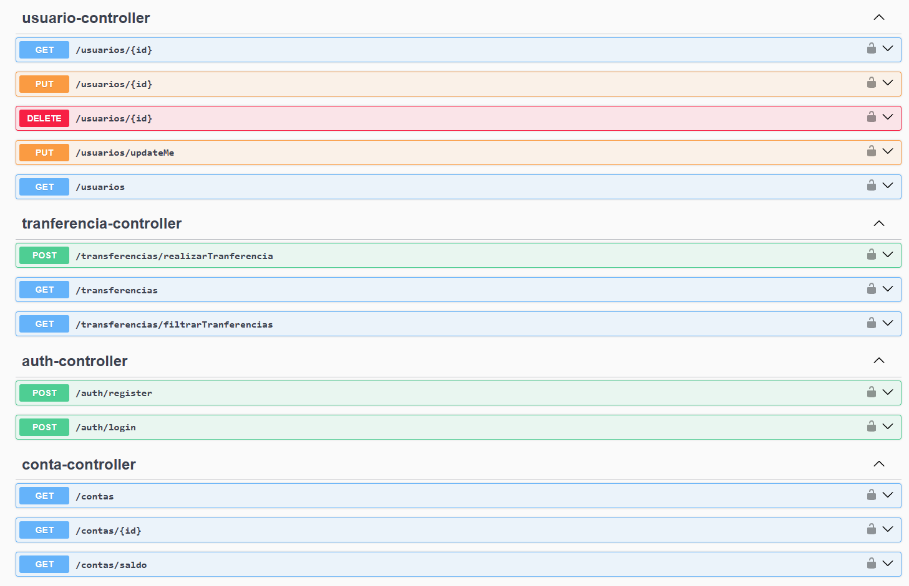

<div align="center">
  <h1>💳 JavaPay API - Payment Gateway</h1>
  
  <p>
    <a href="https://www.oracle.com/java/"></a>
    <a href="https://spring.io/projects/spring-boot"></a>
    <a href="https://spring.io/projects/spring-security"></a>
    <a href="https://swagger.io/"></a>
    <a href="https://opensource.org/licenses/MIT"></a>
  </p>

  <blockquote>
    <b>API RESTful de alta performance que simula o core bancário de uma fintech.</b><br>
    Focada no processamento seguro de transferências financeiras, autenticação JWT, gestão de contas e resiliência de dados.
  </blockquote>
</div>

<br>

## 📸 Interface e Documentação (Swagger UI)

A API é totalmente interativa e documentada via **SpringDoc OpenAPI (v2.8.5)**. É possível testar os fluxos de autenticação, saldos e movimentações diretamente do navegador.

<div align="center">
  
</div>

---

## 🧠 Arquitetura e Decisões Técnicas

Construída sob princípios modernos de engenharia de software para garantir robustez em transações financeiras:

*   **Java 21 Moderno:** Aproveitamento de recursos das versões LTS mais recentes do ecossistema Java.
*   **Autenticação Stateless (Auth0 JWT 4.5.2):** Tokens criptografados e validados a cada requisição, eliminando estado em sessão e permitindo escala horizontal.
*   **Fail-Fast Validation & Bean Validation:** Algoritmo de validação de CPF e checagem prévia de saldo bloqueiam dados corrompidos/inválidos antes de atingirem a camada de persistência.
*   **Transações ACID (`@Transactional`):** Garantia de atomicidade nas transferências: o débito na origem só é consolidado se o crédito no destino ocorrer com sucesso.
*   **Padrão DTO & Encapsulamento:** Mapeamento isolado entre Entidades (`Usuario`, `Conta`) e os objetos de entrada/saída, protegendo dados sensíveis como senhas (criptografadas via **BCrypt**).
*   **Tratamento Global de Exceções (RFC 7807):** Respostas de erro padronizadas via `@RestControllerAdvice` para exceções de domínio como `SemExtratoException` ou requisições malformadas.

---

## ⚙️ Como Executar Localmente

### Pré-requisitos
*   **Java 21** instalado.
*   **Maven 3.8+** instalado.

### Passo a Passo

```bash
# 1. Clone o repositório
git clone [https://github.com/kalebzaki4/payment-gateway-api.git](https://github.com/kalebzaki4/payment-gateway-api.git)

# 2. Acesse o diretório do projeto
cd payment-gateway-api

# 3. Compile e rode os testes
./mvnw clean test

# 4. Inicie a aplicação
./mvnw spring-boot:run

```

> 🔗 **Acesse o Swagger UI em:** `http://localhost:8080/swagger-ui/index.html`

---

## 🛣️ Guia de Endpoints

Abaixo estão as rotas da aplicação. Clique para expandir os detalhes e exemplos de payloads.

* `POST /auth/register`: Cadastra um usuário com CPF válido e cria automaticamente sua Conta Digital atrelada.
* `POST /auth/login`: Autentica o usuário e retorna o Token JWT.

**Exemplo de Payload (Registro):**

```json
{
  "nome": "Kaleb Tester",
  "cpf": "111.444.777-35",
  "email": "kaleb@test.com",
  "senha": "123"
}

```

* `GET /contas/saldo`: Retorna saldo e dados da conta do usuário atualmente autenticado via Token JWT.
* `GET /contas/{id}`: Consulta informações da conta específica.
* `GET /contas`: Listagem geral de contas.

* `POST /transferencias/realizarTranferencia`: Realiza o envio de valores entre contas com validação imediata de saldo.
* `GET /transferencias`: Retorna o histórico/extrato completo de transações da conta.
* `GET /transferencias/filtrarTranferencias`: Permite a filtragem do histórico.

**Exemplo de Payload (Transferência):**

```json
{
  "cpf": "38829371018",
  "saldo": 50.00
}

```

---

## 🛠️ Stack Tecnológica (baseada no `pom.xml`)

| Categoria | Tecnologia / Dependência | Versão |
| --- | --- | --- |
| **Core** | Java | 21 |
| **Framework** | Spring Boot | 3.4.3 |
| **Segurança** | Spring Security & Auth0 java-jwt | 4.5.2 |
| **Documentação** | SpringDoc OpenAPI WebMVC UI | 2.8.5 |
| **Persistência** | Spring Data JPA & Hibernate | (Managed by Spring) |
| **Bancos de Dados** | MySQL (Runtime) / H2 (In-Memory/Tests) | - |
| **Templates / View** | Thymeleaf Starter | (Managed by Spring) |
| **Produtividade** | Lombok & Spring DevTools | - |
| **Testes** | JUnit 5, Mockito & Spring Security Test | - |

---

## 🚀 Próximos Passos (Roadmap)

* [ ] Criar arquivo `Dockerfile` e `docker-compose.yml` (App + Banco MySQL).
* [ ] Configurar **GitHub Actions** (`ci.yml`) para executar testes automatizados em cada Push/PR.
* [ ] Adicionar métricas e monitoramento de saúde via **Spring Boot Actuator**.

---
